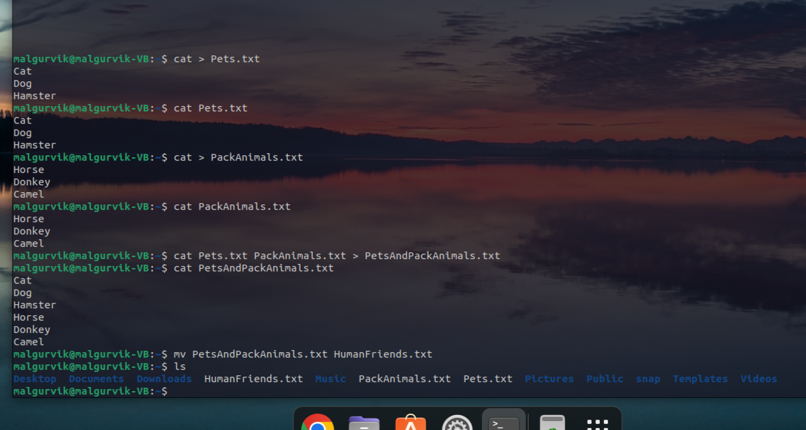
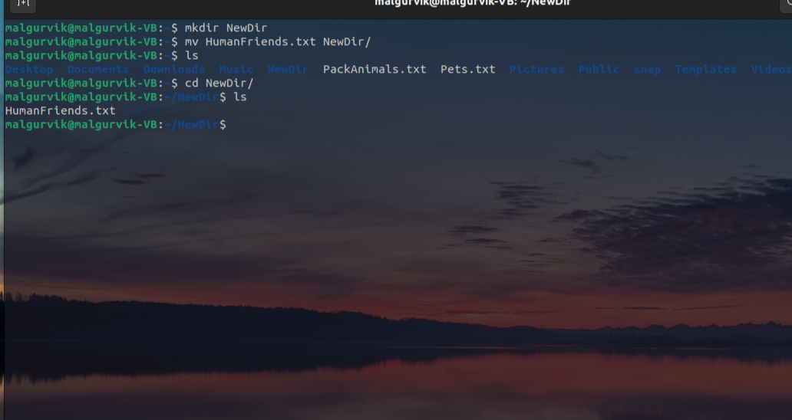
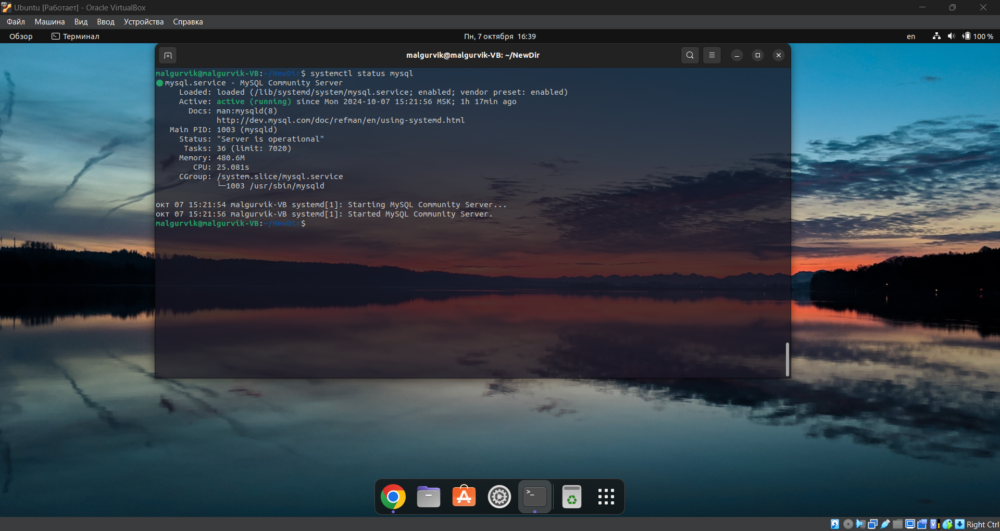
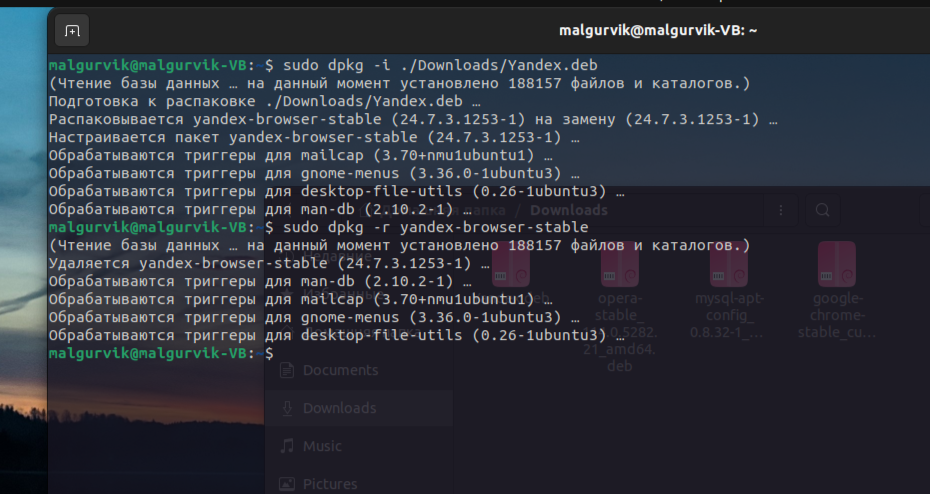
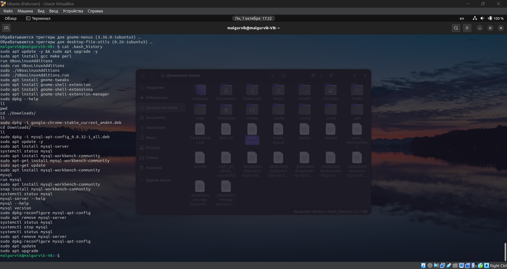

# Задание

### *Операционные системы и виртуализация (Linux)*

1. Использование команды cat в Linux
    - Создать два текстовых файла: "Pets"(Домашние животные) и "Pack animals"(вьючные животные), используя команду `cat`
      в терминале Linux. В первом файле перечислить собак, кошек и хомяков. Во втором — лошадей, верблюдов и ослов.
    - Объединить содержимое этих двух файлов в один и просмотреть его содержимое.
    - Переименовать получившийся файл в "Human Friends"(.
      Пример конечного вывода после команды “ls” :
      Desktop Documents Downloads HumanFriends.txt Music PackAnimals.txt Pets.txt Pictures Videos
        
    - Создать новую директорию и переместить туда файл "Human Friends".
      
2. Работа с MySQL в Linux. “Установить MySQL на вашу вычислительную машину ”
    - Подключить дополнительный репозиторий MySQL и установить один из пакетов из этого репозитория.
      
3. Управление deb-пакетами
    - Установить и затем удалить deb-пакет, используя команду `dpkg`.
      
4. История команд в терминале Ubuntu
    - Сохранить и выложить историю ваших терминальных команд в Ubuntu.
      

### *Объектно-ориентированное программирование*

1. Диаграмма классов
    - Создать диаграмму классов с родительским классом "Животные", и двумя подклассами: "Pets" и "Pack animals".
      В составы классов которых в случае Pets войдут классы: собаки, кошки, хомяки, а в класс Pack animals войдут:
      Лошади, верблюды и ослы.
      Каждый тип животных будет характеризоваться (например, имена, даты рождения, выполняемые команды и т.д)
      

### *Работа с MySQL*

1. После создания диаграммы классов в 6 пункте, в 7 пункте база данных "Human Friends" должна быть структурирована в
   соответствии с этой диаграммой. Например, можно создать таблицы, которые будут соответствовать классам "Pets" и "Pack
   animals", и в этих таблицах будут поля, которые характеризуют каждый тип животных (например, имена, даты рождения,
   выполняемые команды и т.д.).
2. В ранее подключенном MySQL создать базу данных с названием "Human Friends".

- Создать таблицы, соответствующие иерархии из вашей диаграммы классов.
    - Заполнить таблицы данными о животных, их командах и датами рождения.
    - Удалить записи о верблюдах и объединить таблицы лошадей и ослов.
    - Создать новую таблицу для животных в возрасте от 1 до 3 лет и вычислить их возраст с точностью до месяца.
    - Объединить все созданные таблицы в одну, сохраняя информацию о принадлежности к исходным таблицам.

[SQL script](sql_script.sql)

### *ООП*

1. Создать иерархию классов, который будет повторять диаграмму классов созданную в задаче 6(Диаграмма классов).

2. Программа-реестр домашних животных
    - Написать программу, которая будет имитировать реестр домашних животных.
      Должен быть реализован следующий функционал:

        - Добавление нового животного
            - Реализовать функциональность для добавления новых животных в реестр.   
              Животное должно определяться в правильный класс (например, "собака", "кошка", "хомяк" и т.д.)
            - Список команд животного
                - Вывести список команд, которые может выполнять добавленное животное (например, "сидеть", "лежать").

        - Обучение новым командам
        - Добавить возможность обучать животных новым командам.
        - Вывести список животных по дате рождения
        - Навигация по меню
            - Реализовать консольный пользовательский интерфейс с меню для навигации между вышеуказанными функциями.
        - Счетчик животных
            - Создать механизм, который позволяет вывести на экран общее количество созданных животных любого типа (Как
              домашних,
              так и вьючных), то есть при создании каждого нового животного счетчик увеличивается на “1”.

[Код](animal_registry)